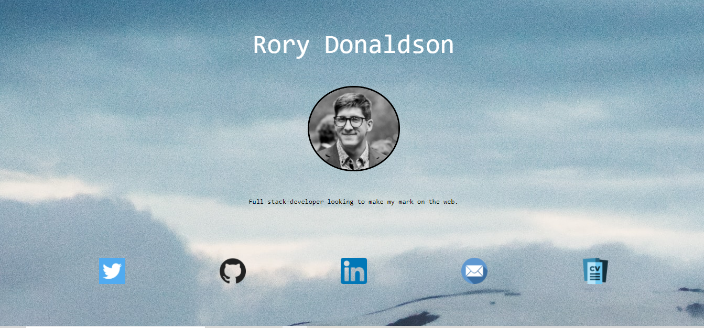

# Portfolio_3.0

## About

Another portfolio! Includes a few links to deployed applications and their respective github repositories, as well as contact info for yours-truly. If you want to, you can even browse through all of my zero tweets! There's also a link for hate-mail if the color scheme offends you.

## Screenshots

Screenshot #1:

## Links

- Live deploy of main on GitHub Pages: https://rorylkd.github.io/Portfolio_3.0/ 

## Technology Used

- HTML
- CSS

## References

Background photo by [Norris Niman](https://unsplash.com/@norrisniman?utm_source=unsplash&utm_medium=referral&utm_content=creditCopyText") on [Unsplash](https://unsplash.com/s/photos/minimalist-fractal?utm_source=unsplash&utm_medium=referral&utm_content=creditCopyText)

Icons made by <https://www.freepik.com> from <https://www.flaticon.com/>

